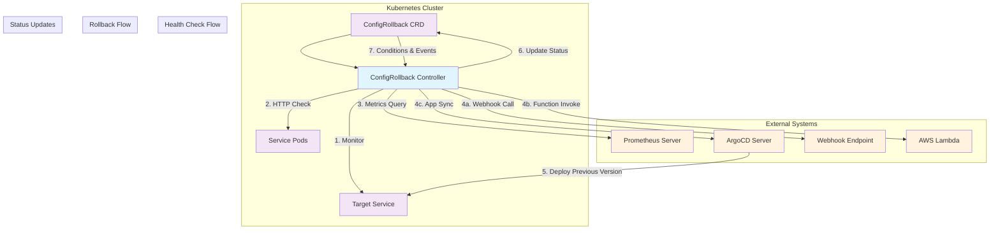
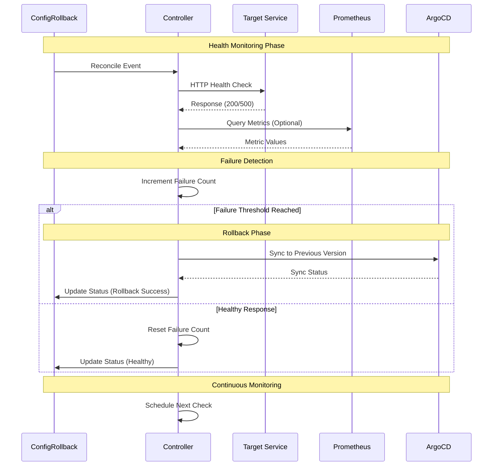

# Kubernetes Configuration Rollback Controller

A production-ready Kubernetes operator that monitors service health and automatically triggers configuration rollbacks when issues are detected. Built with kubebuilder for advanced Kubernetes operator development.

## Overview

This controller demonstrates advanced Kubernetes operator patterns including:
- Custom Resource Definitions (CRDs) with comprehensive validation
- Health monitoring via HTTP endpoints and Prometheus metrics
- Automated rollback mechanisms (Webhook, AWS Lambda, GitOps)
- Production-ready status management and observability
- Proper RBAC and security practices

## Architecture Diagram



## Controller Workflow



Built-in Probes Response:
Pods start with bad config
Health checks fail (can't connect to DB)
Kubernetes restarts pods indefinitely
Same bad config keeps getting deployed
Service stays down until manual intervention
Our Controller Response:
Detects consecutive failures (configurable threshold)
Triggers ArgoCD rollback to previous working version
Monitors rollback success and reports status
Integrates with external systems for notifications

livenessProbe:   # Restarts pod when health check fails
readinessProbe:  # Removes pod from service when not ready
startupProbe:    # Delays other probes during startup

## Architecture

The controller consists of two main components:

### 1. Custom Resource Definition (CRD) - `configrollback_types.go`

Defines the API schema for ConfigRollback resources with comprehensive validation.

#### ConfigRollbackSpec - Desired State
```go
type ConfigRollbackSpec struct {
    TargetService      ServiceTarget           // Service to monitor
    HealthChecks       HealthCheckConfig       // How to check health
    RollbackConfig     RollbackConfiguration   // How to rollback
    MonitoringInterval int32                   // Check frequency (10-3600s)
    Enabled           bool                     // Enable/disable monitoring
}
```

**Key Components:**

- **ServiceTarget**: Defines what service to monitor (name, namespace, port)
- **HealthCheckConfig**: Two types of health checks:
  - **HTTPHealthCheck**: Direct HTTP endpoint checks with custom headers and expected status codes
  - **PrometheusHealthCheck**: PromQL queries with threshold comparisons (gt, lt, gte, lte, eq, ne)
  - `FailureThreshold` (1-10, default 3): How many failures trigger rollback
  - `TimeoutSeconds` (1-300s, default 10s): Health check timeout

- **RollbackConfiguration**: Three rollback mechanisms:
  - **Webhook**: HTTP calls to external systems
  - **AWS Lambda**: Serverless function invocation
  - **GitOps**: Git repository manipulation for config changes
  - `MaxRollbackAttempts` (1-5, default 1): Retry limit

#### ConfigRollbackStatus - Observed State
```go
type ConfigRollbackStatus struct {
    Conditions           []metav1.Condition  // Kubernetes standard conditions
    LastHealthCheckTime  *metav1.Time       // When last checked
    HealthCheckStatus    string             // Healthy/Unhealthy/Unknown
    ConsecutiveFailures  int32              // Failure counter
    LastRollbackTime     *metav1.Time       // When last rollback occurred
    RollbackAttempts     int32              // Current rollback attempt count
    RollbackStatus       string             // Success/Failed/InProgress/NotAttempted
    LastRollbackMessage  string             // Details about last rollback
    ObservedGeneration   int64              // Generation tracking
}
```

### 2. Controller Logic - `configrollback_controller.go`

Implements the reconciliation loop following Kubernetes controller patterns.

#### Main Reconcile Loop
```go
func (r *ConfigRollbackReconciler) Reconcile(ctx context.Context, req ctrl.Request) (ctrl.Result, error)
```

**Reconciliation Flow:**
1. **Fetch Resource**: Get the ConfigRollback resource from the cluster
2. **Handle Deletion**: Process finalizers when resource is being deleted
3. **Add Finalizer**: Ensure proper cleanup handling
4. **Skip if Disabled**: Check the `Enabled` flag
5. **Health Check**: Execute configured health monitoring
6. **Failure Tracking**: Count consecutive failures
7. **Rollback Decision**: Trigger rollback when threshold is reached
8. **Status Update**: Update resource status with current state
9. **Requeue**: Schedule next reconciliation based on monitoring interval

#### Health Check Implementation

**HTTP Health Check:**
```go
func (r *ConfigRollbackReconciler) performHTTPHealthCheck(ctx context.Context, configRollback *configv1alpha1.ConfigRollback) (string, string)
```

Process:
1. **URL Construction**: `http://{service}.{namespace}.svc.cluster.local:{port}{path}`
2. **Request Setup**: Creates HTTP GET request with custom headers and timeout
3. **Status Validation**: Compares response status code with expected code (default 200)
4. **Result**: Returns `Healthy`/`Unhealthy` with descriptive message

**Prometheus Health Check** (Placeholder):
Currently returns `Unknown` status. Real implementation would:
1. Query Prometheus API with PromQL
2. Parse metric values from response
3. Compare against threshold using operator (gt, lt, gte, lte, eq, ne)
4. Return health status based on comparison

#### Rollback Mechanisms

**Webhook Rollback:**
- Makes HTTP calls to external webhook URLs
- Supports custom headers and JSON payloads
- Configurable HTTP methods (POST, PUT, PATCH)

**AWS Lambda Rollback:**
- Invokes AWS Lambda functions for rollback logic
- Requires function name, region, and optional payload
- Would use AWS SDK in real implementation

**GitOps Rollback:**
- Manipulates Git repositories for configuration changes
- Supports branch specification and file path targeting
- Would clone, modify, commit, and push in real implementation

#### Status Management

**Kubernetes Conditions:**
The controller uses standard Kubernetes condition types:
- **Available**: Service is healthy
- **Degraded**: Service failed health checks
- **Progressing**: Health status unknown or monitoring disabled

**Failure Tracking:**
- `ConsecutiveFailures`: Incremented on each health check failure, reset on success
- `RollbackAttempts`: Tracks rollback attempts for current failure episode
- `FailureThreshold`: Configurable threshold (1-10, default 3) to trigger rollbacks

#### Controller Lifecycle

**Finalizers:**
- Adds `config.rahulkshinde.dev/finalizer` for proper cleanup
- Handles resource deletion gracefully
- Prevents resource deletion until cleanup is complete

**Reconciliation Scheduling:**
- Uses `RequeueAfter` with configurable `MonitoringInterval` (10-3600s, default 30s)
- Ensures continuous monitoring without overwhelming the system
- Immediate requeue on configuration changes

## Sample Configurations

### HTTP Health Check with Webhook Rollback
```yaml
apiVersion: config.rahulkshinde.dev/v1alpha1
kind: ConfigRollback
metadata:
  name: configrollback-sample
  namespace: default
spec:
  enabled: true
  monitoringInterval: 30
  
  targetService:
    name: my-app
    namespace: default
    port: 8080
  
  healthChecks:
    failureThreshold: 3
    timeoutSeconds: 10
    httpHealthCheck:
      path: /health
      expectedStatusCode: 200
      headers:
        User-Agent: "ConfigRollback-Controller/1.0"
  
  rollbackConfig:
    rollbackType: webhook
    maxRollbackAttempts: 2
    webhookConfig:
      url: "https://api.example.com/rollback"
      method: "POST"
      headers:
        Authorization: "Bearer token123"
        Content-Type: "application/json"
      payload: '{"action": "rollback", "service": "my-app"}'
```

### Prometheus Health Check with GitOps Rollback
```yaml
apiVersion: config.rahulkshinde.dev/v1alpha1
kind: ConfigRollback
metadata:
  name: configrollback-prometheus-sample
  namespace: default
spec:
  enabled: true
  monitoringInterval: 60
  
  targetService:
    name: payment-service
    namespace: production
    port: 9090
  
  healthChecks:
    failureThreshold: 2
    timeoutSeconds: 15
    prometheusHealthCheck:
      prometheusURL: "http://prometheus.monitoring.svc.cluster.local:9090"
      query: "rate(http_requests_total{service='payment-service',status=~'5..'}[5m])"
      threshold: "0.05"
      operator: "lt"
  
  rollbackConfig:
    rollbackType: gitops
    maxRollbackAttempts: 1
    gitOpsConfig:
      repository: "https://github.com/company/k8s-configs.git"
      branch: "main"
      filePath: "apps/payment-service/deployment.yaml"
      previousVersion: "v1.2.3"
```

## RBAC Permissions

The controller requires these permissions:
```go
// +kubebuilder:rbac:groups=config.rahulkshinde.dev,resources=configrollbacks,verbs=get;list;watch;create;update;patch;delete
// +kubebuilder:rbac:groups=config.rahulkshinde.dev,resources=configrollbacks/status,verbs=get;update;patch
// +kubebuilder:rbac:groups=config.rahulkshinde.dev,resources=configrollbacks/finalizers,verbs=update
// +kubebuilder:rbac:groups="",resources=services,verbs=get;list;watch
// +kubebuilder:rbac:groups="",resources=events,verbs=create;patch
```

## Getting Started

### Prerequisites
- go version v1.24.0+
- docker version 17.03+
- kubectl version v1.11.3+
- Access to a Kubernetes v1.11.3+ cluster

### Development Setup

#### Initial Project Setup
```bash
# Initialize kubebuilder project
kubebuilder init --domain rahulkshinde.dev --repo github.com/rahulkshinde/k8s-config-controller --plugins=go.kubebuilder.io/v4

# Create ConfigRollback CRD and controller
kubebuilder create api --group config --version v1alpha1 --kind ConfigRollback --resource --controller

# Download dependencies
go mod tidy
```

#### Local Cluster Setup
```bash
# Create kind cluster configuration
cat > kind-config.yaml << EOF
kind: Cluster
apiVersion: kind.x-k8s.io/v1alpha4
name: config-controller
nodes:
- role: control-plane
EOF

# Create local cluster
kind create cluster --config kind-config.yaml

# Verify cluster
kubectl cluster-info
```

#### Install and Run Controller
```bash
# Generate and install CRDs
make manifests
make install

# Verify CRD installation
kubectl get crd
kubectl describe crd configrollbacks.config.rahulkshinde.dev

# Run controller locally
make run
```

#### Test with Sample Resources
```bash
# Apply sample configurations
kubectl apply -f config/samples/config_v1alpha1_configrollback.yaml
kubectl apply -f config/samples/prometheus-sample.yaml

# Monitor controller logs and resource status
kubectl get configrollbacks -o wide
kubectl describe configrollback configrollback-sample
```

### Production Deployment

#### Build and Deploy
```bash
# Build and push image
make docker-build docker-push IMG=<registry>/k8s-config-controller:tag

# Deploy to cluster
make deploy IMG=<registry>/k8s-config-controller:tag

# Create sample resources
kubectl apply -k config/samples/
```

#### Monitoring and Observability
```bash
# Check controller status
kubectl get pods -n k8s-config-controller-system

# View controller logs
kubectl logs -n k8s-config-controller-system deployment/k8s-config-controller-controller-manager

# Monitor ConfigRollback resources
kubectl get configrollbacks --all-namespaces
kubectl describe configrollback <name> -n <namespace>
```

## Development Commands

### Code Generation and Validation
```bash
# Generate manifests and code
make manifests generate

# Run tests
make test

# Lint and validate code
make vet fmt

# Build binary
make build
```

### Cleanup
```bash
# Delete sample resources
kubectl delete -k config/samples/

# Uninstall CRDs
make uninstall

# Remove controller deployment
make undeploy

# Delete kind cluster
kind delete cluster --name config-controller
```

## License

Copyright 2025.

Licensed under the Apache License, Version 2.0 (the "License");
you may not use this file except in compliance with the License.
You may obtain a copy of the License at

    http://www.apache.org/licenses/LICENSE-2.0

Unless required by applicable law or agreed to in writing, software
distributed under the License is distributed on an "AS IS" BASIS,
WITHOUT WARRANTIES OR CONDITIONS OF ANY KIND, either express or implied.
See the License for the specific language governing permissions and
limitations under the License.
